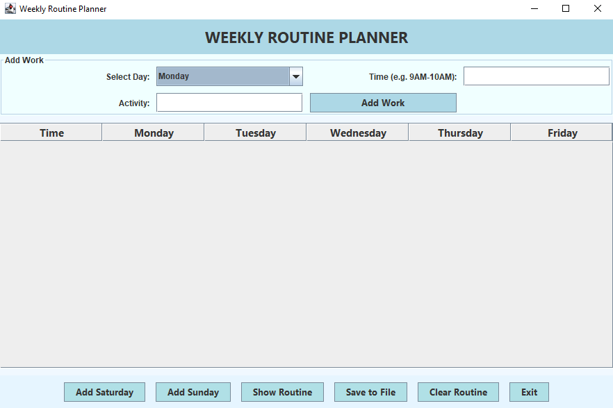
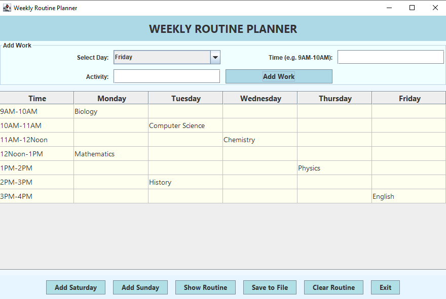
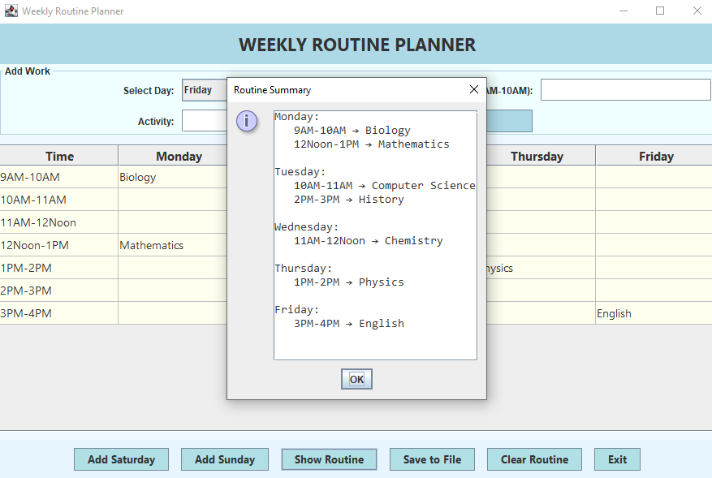
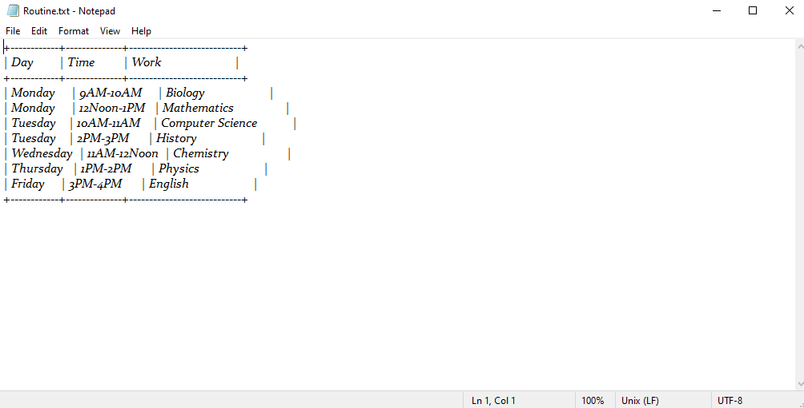

# 🗓️ Weekly Routine Planner (Java Swing)

A clean, interactive **Weekly Routine Planner GUI** built using **Java Swing**.  
It helps users easily organize, view, and save their weekly class or work schedule — with flexible days, customizable times, and automatic text file export.

---

## 🌟 Features

✅ Modern and minimal **GUI-based planner**  
✅ Add work/classes for **any weekday** (Monday–Friday)  
✅ Option to **add Saturday and Sunday** dynamically  
✅ Create **custom time slots** (e.g., 9AM–10AM, 2PM–3PM)  
✅ View your entire weekly schedule in a popup  
✅ Save the routine neatly formatted in `Routine.txt`  
✅ **Clear** or **exit** anytime with one click  
✅ Built using **Java Swing + Collections Framework**

---

## 🧠 How It Works

1. Choose a **day**, enter the **time** (e.g. `10AM-11AM`), and specify the **activity**.  
2. Click **Add Work** → it adds your entry into the weekly table.  
3. Need weekends? Click **Add Saturday** or **Add Sunday** to include them.  
4. Click **Show Routine** to display a summary of all entries.  
5. Click **Save to File** to export the routine to a neat table format in `Routine.txt`.  
6. Use **Clear Routine** to start fresh or **Exit** to close the app.

---

## 🛠️ Technologies Used

- **Language:** Java  
- **Framework:** Swing (JFrame, JTable, JLabel, JPanel, etc.)  
- **Data Structures:** `Map`, `List`, `LinkedHashMap`, `ArrayList`  
- **File Handling:** `BufferedWriter` for saving routines  

---

## 🚀 How to Run

   ```bash
   git clone https://github.com/<your-username>/Weekly-Routine-Planner.git
   cd Weekly-Routine-Planner
   javac WeeklyRoutinePlanner.java
   java WeeklyRoutinePlanner
'''

---

## 🖥️ GUI Preview

### 🔹 Main Application Window


### 🔹 Timetable After Adding Classes


### 🔹 Routine Summary Dialog


### 🔹 Saved Routine (Text File Output)


> All screenshots were captured from the running Swing-based Java GUI application.


